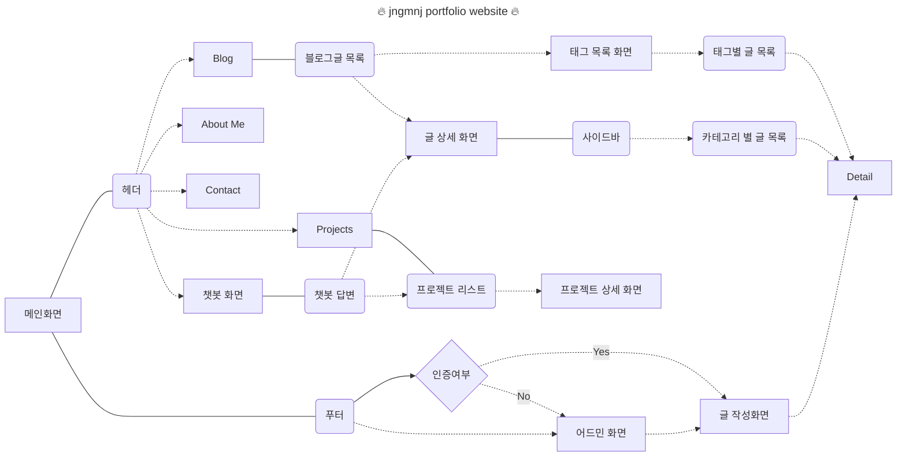

# Portfolio

프론트엔드개발자로서의 포트폴리오 프로젝트입니다.
개발 기간: 2024-07-24 ~ 진행중

# Convention

커밋메시지 컨벤션은

# Architecture

# 개발환경

- NextJS
- Yarn
- ESlint & Prettier

# Skills

# Libraries

- TailwindCSS
- Supabase ?

# flowchart
