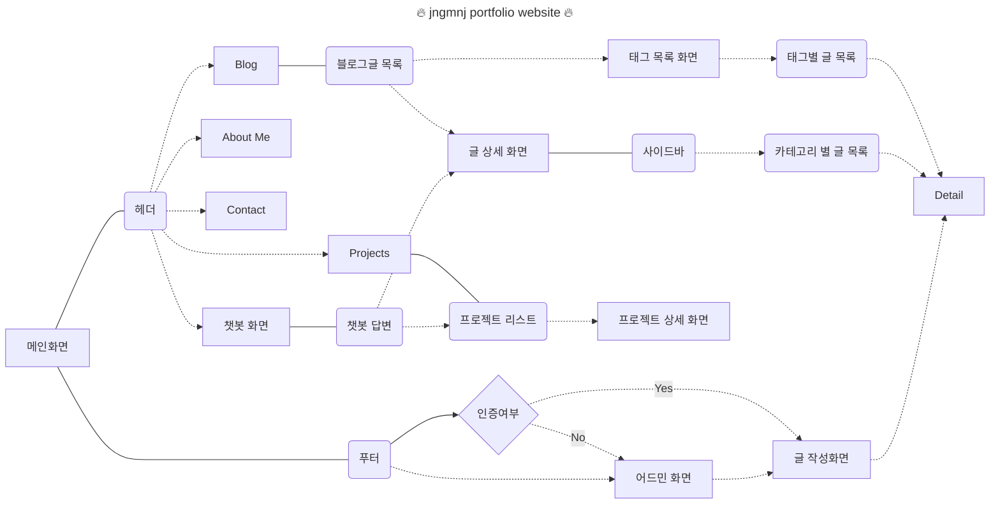

# Portfolio

프론트엔드개발자로서의 포트폴리오 프로젝트입니다.

개발 기간: 2024-07-24 ~ 진행중

## Convention

커밋메시지 컨벤션은
[Conventional Commits](https://www.conventionalcommits.org/en/v1.0.0/) 가이드를
기반으로 하며, 명확하고 일관성 있는 커밋 메시지를 작성하기 위한 규칙입니다.

### 커밋 메시지 구조

```
<type>(<scope>): <subject>
```

- **`<type>`**: 변경 사항의 유형을 나타냅니다.
- **`<scope>`** _(선택사항)_: 변경 사항의 범위를 나타냅니다 (예: 파일, 컴포넌트
  이름).
- **`<subject>`**: 간결한 변경 사항 설명 (현재형 동사로 시작).

### `<type>` 유형

- **`feat`**: 새로운 기능 추가
  - _예_: `feat(header): add responsive navigation bar`
- **`fix`**: 버그 수정
  - _예_: `fix(sidebar): resolve hydration error`
- **`docs`**: 문서 관련 작업
  - _예_: `docs(readme): update installation instructions`
- **`style`**: 코드 포맷팅, 세미콜론 누락 등 코드 변경이 없는 작업
  - _예_: `style(global): apply consistent indentation`
- **`refactor`**: 코드 리팩토링 (기능 변화 없음)
  - _예_: `refactor(api): optimize fetch logic`
- **`test`**: 테스트 추가 또는 수정
  - _예_: `test(utils): add unit tests for formatDate`
- **`chore`**: 빌드 프로세스 또는 기타 잡무 수정
  - _예_: `chore(deps): update dependencies`
- **`perf`**: 성능 개선
  - _예_: `perf(image): reduce image load time`
- **`ci`**: CI 설정 및 스크립트 변경
  - _예_: `ci(workflows): add deploy job`
- **`revert`**: 이전 커밋을 되돌릴 때 사용
  - _예_: `revert: fix(nav): resolve alignment issue`

### 커밋 메시지의 예

1. **`feat` 예시**:

   ```
   feat(auth): implement user login functionality
   ```

2. **`fix` 예시**:

   ```
   fix(header): resolve navigation rendering bug
   ```

3. **`chore` 예시**:

   ```
   chore(package): update dependencies to latest versions
   ```

4. **`style` 예시**:
   ```
   style(button): apply consistent padding and margin
   ```

## Architecture

## 개발환경

- NextJS
- Yarn
- ESlint & Prettier

## Skills

## Libraries

- TailwindCSS
- Supabase ?

## flowchart


